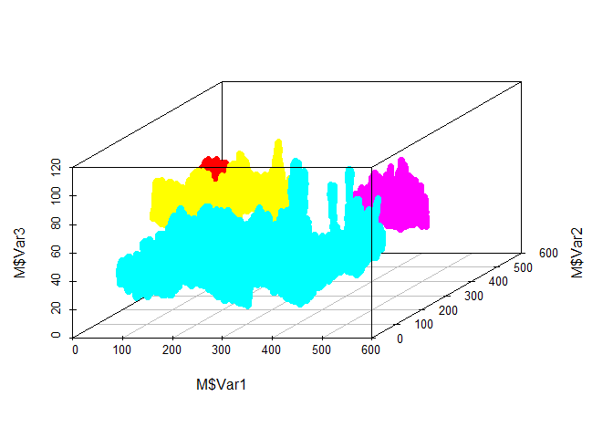

RCon3D: Analyzing confocal images of microbial biofilms
-------------------------------------------------------

The images has to be binary, and are assumed to have been thresholded
already The example image has four channels (named "xan","pan","ste" and
"mic").

First install the package

    library(devtools)
    install_github("Russel88/RCon3D")

Then lets load the package and some packages for plotting

    library(RCon3D)
    library(ggplot2)
    library(reshape2)
    library(scatterplot3d)

Load the images. If the images have already been loaded we can use
findIMG to load in the images. The path should lead to folder with a
.tif for each image (with all z-stacks in one), or a folder with
subfolders in which the images is split in z-stacks and channels. An
internal function tiffToArray is partly borrowed from
github/rmnppt/iMage

    myimg <- loadIMG("//a00143.science.domain/cmf483/Documents/PhD/Projects/Image Analysis/Data",c("xan","pan","ste","mic"),split=TRUE)

    ## Loading image 1

    myimg <- findIMG("//a00143.science.domain/cmf483/Documents/PhD/Projects/Image Analysis/Data")

Quantify pixels for each layer for the four channels. The naming
argument is optional but can be used to look through the names of the
images and add corresponding variables Here it looks for "24h" in the
image name, and makes a variable called Time. This is of course only
useful when there are several images with different metadata. (Eg.
Time=c("12h","24h"))

    myq <- Quantify(myimg,channels=c("xan","pan","mic","ste"),naming=list(Time=c("24h")))
    head(myq)

    ##                          Img Channel Count Layer Time
    ## 1 FourSpecies24h_xan_Array.R     xan  1583     1  24h
    ## 2 FourSpecies24h_xan_Array.R     xan  1985     2  24h
    ## 3 FourSpecies24h_xan_Array.R     xan  2225     3  24h
    ## 4 FourSpecies24h_xan_Array.R     xan  2542     4  24h
    ## 5 FourSpecies24h_xan_Array.R     xan  3012     5  24h
    ## 6 FourSpecies24h_xan_Array.R     xan  3508     6  24h

Plot quantification

    p <- ggplot(data=myq,aes(x=Layer,y=Count,colour=Channel,group=Channel)) +
      theme_classic() +
      geom_freqpoly(stat="identity",position=position_dodge(width = 0),size=1) +
      coord_flip()
    p

As the bottom of the specimen is in the high numbers of the layers, lets
reverse layers and plot again. Note that trim=TRUE. This is because we
think the layer with most fill is the actual bottom of the specimen, and
we therefore trim away all that is below that layer

    myq.std <- LayerStd(myq,layer.start = "Top",trim=TRUE)

    p <- ggplot(data=myq.std,aes(x=NewLayer,y=Count,colour=Channel,group=Channel)) +
      theme_classic() +
      geom_freqpoly(stat="identity",position=position_dodge(width = 0),size=1) +
      coord_flip()
    p

Lets calculate cross-correlation between channels "pan" and "xan". A
cross-correlation of 1 equals random positioning, &lt;1 means
segregation and &gt;1 means aggregation. It is similar to co-aggregation
implemented in daime (<http://dome.csb.univie.ac.at/daime>), although
this calculates on randomly subsetted number of pixels which decreases
runtime.

First we find out how many microns we can scan. It has to be a multiple
of both zstep and pwidth

    pwidth <- 0.75
    zstep <- 0.25
    library(rootSolve)
    uniroot.all(function(x) x%%pwidth + x%%zstep,interval=c(0,30))

    ##  [1]  0.0  1.5  3.0  4.5  6.0  7.5  9.0 10.5 12.0 13.5 15.0 16.5 18.0 19.5
    ## [15] 21.0 22.5 24.0 25.5 27.0 28.5 30.0

Ok. lets try 15 microns then. As an example we pick 100 random pixels
(should be higher for actual analysis), and we run the whole thing 5
times to see how picking random pixels affect the variability of the
result

    #mycc <- CrossCorX(imgs=myimg,channels=c("xan","pan"),size=15,npixel=100,dstep=1,pwidth=0.75,zstep=0.25,R=5)

Plot the result

    #p <- ggplot(mycc,aes(x=Distance,y=CC,group=R)) +
    #  theme_classic() +
    #  geom_hline(yintercept=1) +
    #  geom_line() 
    #p

Lets find aggregates of "mic"

    my.agg <- Agg(myimg,"mic",pwidth=0.75,zstep=0.25)

    ## Running replica 1

Lets plot the 3D image of aggregates larger than 20000 pixels

    M <- melt(my.agg[[2]][[1]])
    M <- M[!is.na(M$value),]
    tabl <- as.data.frame(table(M$value))
    subtable <- tabl[tabl$Freq>20000,]
    M <- M[M$value %in% subtable$Var1,]
    scatterplot3d(M$Var1,M$Var2,M$Var3,color=M$value,angle=45,pch=19)

