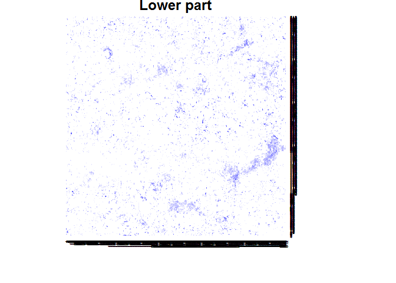
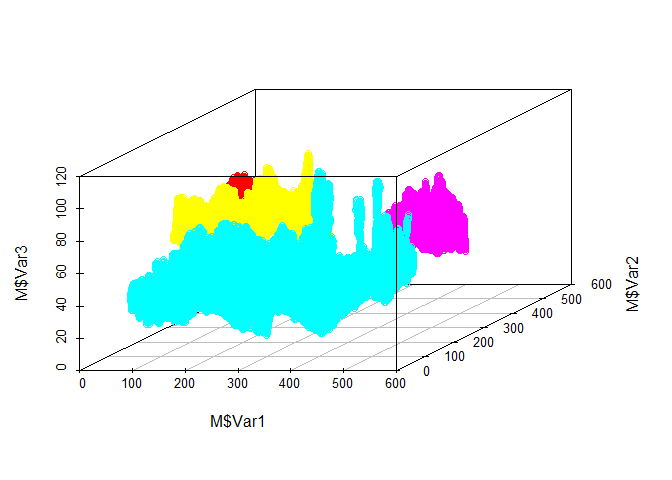

RCon3D: Analyzing 3D confocal images of microbial biofilms
----------------------------------------------------------

This is an R package for various 3D analyses confocal images of
microbial biofilms. Below is a tutorial explaining the main functions

#### All functions

`loadIMG` Load .tif files and turn them into arrays, and save them as
RDS files ready for downstream analysis

`findIMG` Find already loaded images in a set directory

`quant` Quantifies the number of pixels in each image, for each channel
at each layer.

`layer_stand` Standardize layers based on fill. Relevant if the bottom
of the specimen is the layer with highest fill

`layer_split` Splits quantification in Top, Middle and Bottom based on
fill and/or a set number of layers

`occupancy` Estimates the proportion a (target) channel occupy around a
(focal) channel

`co_agg` Estimates the co-aggregation between two channels. An
undirected version of `occupancy`

`cross_ratio` Estimates the ratio between two channels (targets), at
some distance from a focal channel

`clumps` Find 3D clumps (aggregates) based on clumping together
neighbouring pixels.

`create_random` Create random images for testing

`create_nulls` Create image files for the empty spaces in an image, such
that this can be used in the analysis. For example, it can then be
calculated how much empty space there is a around a certain channel with
`occupancy`

`extract_layers` With the output from `layer_split` it makes a list of
what layers to analyze in `occupancy`, `clumps`, `co_agg` and
`cross_ratio`

`xy_splits` Splits the image in each xy position and then run an
analysis

#### Acknowledgment note:

An internal function, `tiff_to_array`, is partly borrowed from
<https://github.com/rmnppt/iMage>. Furthermore, some of the algorithmic
framework for the `co_agg`,`occupancy` and `cross_ratio` analysis is
also borrowed from this repository.

### Citation

If you use the `quant` and `layer_split` functions please cite: [Liu et
al. (2017) Low-abundant species facilitates specific spatial
organisation that promotes multispecies biofilm formation. *Envir.
Microbiol.*](http://onlinelibrary.wiley.com/doi/10.1111/1462-2920.13816/abstract)

### Loading packages

First install the package.

    library(devtools)
    #install_github("Russel88/RCon3D")

Then lets load the package and some packages for plotting

    library(RCon3D)
    library(ggplot2)
    library(reshape2)
    library(scatterplot3d)

### Load the images

First we need to load the images. Images have to be .tif files, and have
to be binary, and are thus assumed to have been thresholded already. The
example image has four channels (named "xan","pan","ste" and "mic"). It
is available here (github/Russel88/RCon3D/ExampleData.zip)

If the images have already been loaded we can use `findIMG` to load in
the images.

The path should lead to folder with a .tif for each image (with all
z-stacks in one .tif file), or a folder with subfolders in which the
images are split in z-stacks and channels.

    #myimg <- loadIMG("/Data",c("xan","pan","ste","mic"),split=TRUE)
    myimg <- findIMG("/Data")

### Quantify pixels for each layer for each channel

When images are loaded, we start downstream analysis. First, lets simply
quantify the pixels for each layer, channel and image

    myq <- quant(myimg,channels=c("xan","pan","mic","ste"),naming=list(Time=c("24h")))
    head(myq)

The naming argument is optional but can be used to look through the
names of the images and add corresponding variables Here it looks for
"24h" in the image name, and makes a variable called Time. This is of
course only useful when there are several images with different
metadata. (Eg. Time=c("12h","24h"))

Plot quantification

    p <- ggplot(data=myq,aes(x=Layer,y=Count,colour=Channel,group=Channel)) +
      theme_classic() +
      geom_freqpoly(stat="identity",position=position_dodge(width = 0),size=1) +
      coord_flip()
    p

### Sectioning

We can also split the image in top, middle and bottom based on various
criteria. Here we define the Top as all layers from the very top until
75 percent of the image is filled (pt=0.75). The bottom is the bottom 20
layers (add.b=20). The middle is the rest. Note that the top of the
specimen is in the layers with the low numbers, hence layer.start =
"Top".

    myq.split <- layer_split(myq,layer.start = "Top",trim=FALSE,side=512,pt=0.75,add.b=20,add.t=0)

    p <- ggplot(data=myq.split,aes(x=Layer,y=Count,colour=Split,group=Split)) +
      theme_classic() +
      geom_freqpoly(stat="identity",position=position_dodge(width = 0),size=1) +
      coord_flip() +
      facet_grid(.~Channel)
    p

#### xy-sectioning

Another way to section the image in an upper and lower part is to split
the layers for each xy-position. The `xy_splits` function runs an
analysis for each xy-position. If we for example sum for each
xy-position we will get a biomass distribution across the image. We can
also use the function to section the image and then sum. As the
sectioning is done for each xy-position it will take a variable biomass
distribution into account. Here we say that the upper part is the upper
50% for each xy-position.

    my.xy.split <- xy_splits(myimg,channels=c("xan","pan","ste","mic"),do="section",upper.part=0.5,layer.start = "Top",cores = 1)

    ## Starting sectioning

    ## 
      |                                                                       
      |                                                                 |   0%
      |                                                                       
      |=================================================================| 100%

The result is a recursive list with matrices of results for each
xy-position as elements

    str(my.xy.split)

    ## List of 1
    ##  $ FourSpecies24h_:List of 2
    ##   ..$ Upper:List of 4
    ##   .. ..$ xan: num [1:512, 1:512] 5 10 27 33 31 36 37 32 26 32 ...
    ##   .. ..$ pan: int [1:512, 1:512] 60 51 42 39 36 30 36 21 29 16 ...
    ##   .. ..$ ste: num [1:512, 1:512] 6 9 8 9 10 16 12 23 35 31 ...
    ##   .. ..$ mic: num [1:512, 1:512] 0 2 0 0 0 0 0 1 0 8 ...
    ##   ..$ Lower:List of 4
    ##   .. ..$ xan: num [1:512, 1:512] 0 0 4 9 2 1 0 2 5 3 ...
    ##   .. ..$ pan: int [1:512, 1:512] 60 66 73 74 75 81 70 76 74 78 ...
    ##   .. ..$ ste: num [1:512, 1:512] 11 6 2 0 0 1 16 2 11 7 ...
    ##   .. ..$ mic: num [1:512, 1:512] 0 0 0 0 0 0 0 0 0 0 ...

Lets plot heatmaps to check the distributions. From the quantification
"xan" appeared to be only in the top, lets see if it is consistent.

    heatmap(my.xy.split[[1]][["Lower"]][["xan"]],Rowv = NA,Colv = NA,main="Lower part",col=colorRampPalette(c("white","blue"))(10))

    heatmap(my.xy.split[[1]][["Upper"]][["xan"]],Rowv = NA,Colv = NA,main="Upper part",col=colorRampPalette(c("white","blue"))(10))

Do we have more in the upper part than the lower part?

    sum(my.xy.split[[1]][["Upper"]][["xan"]])/sum(my.xy.split[[1]][["Lower"]][["xan"]])

    ## [1] 9.932445

10 times more it seems

We can also try the same, but instead define the top as the upper 25
layers.

    my.xy.split2 <- xy_splits(myimg,channels=c("xan","pan","ste","mic"),do="section",upper.part=25L,layer.start = "Top",cores = 1)

    ## Starting sectioning

    ## 
      |                                                                       
      |                                                                 |   0%
      |                                                                       
      |=================================================================| 100%

    sum(my.xy.split2[[1]][["Upper"]][["xan"]])/sum(my.xy.split2[[1]][["Lower"]][["xan"]])

    ## [1] 2.087536

    heatmap(my.xy.split2[[1]][["Lower"]][["xan"]],Rowv = NA,Colv = NA,main="Lower part",col=colorRampPalette(c("white","blue"))(10))

    heatmap(my.xy.split2[[1]][["Upper"]][["xan"]],Rowv = NA,Colv = NA,main="Upper part",col=colorRampPalette(c("white","blue"))(10))

And lets check out the biomass distribution of "pan"

    my.xy.split3 <- xy_splits(myimg,channels="pan",do="sum",cores = 1)
    heatmap(my.xy.split3[[1]][["pan"]],Rowv = NA,Colv = NA,col=colorRampPalette(c("white","blue"))(10))

We can use any function to apply for each xy-position. E.g. for the
median z-position for "mic":

    myfun <- function(x) median(which(x > 0))
    my.xy.split4 <- xy_splits(myimg,channels="mic",do=myfun,cores = 1)
    heatmap(my.xy.split4[[1]][["mic"]],Rowv = NA,Colv = NA,col=colorRampPalette(c("white","blue"))(10))

Or number of layers it spans:

    myfun <- function(x) {
      y <- max(which(x > 0)) - min(which(x > 0))
      if(is.infinite(y)) y <- 0
      return(y) }
    my.xy.split5 <- xy_splits(myimg,channels="mic",do=myfun,cores = 1)
    heatmap(my.xy.split5[[1]][["mic"]],Rowv = NA,Colv = NA,col=colorRampPalette(c("white","blue"))(10))

### 3D Co-aggregation (Cross-correlation)

It might be of interest to analyze how two different channels are
positioned relative to each other. We do this with 3D co-aggregation. A
co-aggregation of 1 equals random positioning at that specific distance,
&lt;1 means segregation and &gt;1 means aggregation.

It is similar to 2D co-aggregation implemented in daime
(<http://dome.csb.univie.ac.at/daime>), but this function works in 3D.

Lets calculate 3D co-aggregation between channels "ste" and "xan".

First we find out how many microns we can scan. It has to be a multiple
of both zstep and pwidth

    pwidth <- 0.75
    zstep <- 0.25
    library(rootSolve)
    uniroot.all(function(x) x%%pwidth + x%%zstep,interval=c(0,30))

    ##  [1]  0.0  1.5  3.0  4.5  6.0  7.5  9.0 10.5 12.0 13.5 15.0 16.5 18.0 19.5
    ## [15] 21.0 22.5 24.0 25.5 27.0 28.5 30.0

When more microns are scanned runtime increases exponetially. Therefore,
choose the lowest number of microns that is biologically meaningful, and
increase them carefully if needed.

Lets try 21 microns. As an example we pick 200 random pixels, and we run
the whole thing 5 times to see how picking random pixels affect the
variability of the result

    mycc <- co_agg(imgs=myimg,channels=c("xan","ste"),size=21,npixel=200,dstep=1,pwidth=0.75,zstep=0.25,R=5)

    ## Starting run 1

    ## Starting run 2

    ## Starting run 3

    ## Starting run 4

    ## Starting run 5

Plot the result

    p <- ggplot(mycc,aes(x=Distance,y=CA,group=R)) +
      theme_classic() +
      geom_hline(yintercept=1) +
      geom_line() 
    p

At small distances "xan" and "ste" appear to be intermixed more than
expected from random chance

### 3D Occupancy

We can also quantify how much space a channel (target) occupy at certain
distances from another channel (focal). This is similar to
co-aggregation, although this is directed.

Lets run it until 21 microns. As an example we pick 200 random pixels,
and we run the whole thing 5 times to see how picking random pixels
affect the variability of the result

When more microns are scanned runtime increases exponetially. Therefore,
choose the lowest number of microns that is biologically meaningful, and
increase them carefully if needed.

    myocc <- occupancy(imgs=myimg,focal.channel="ste",target.channel="xan",size=21,npixel=200,dstep=1,pwidth=0.75,zstep=0.25,R=5)

    ## Starting run 1

    ## Starting run 2

    ## Starting run 3

    ## Starting run 4

    ## Starting run 5

Plot the result. The red line is the actual proportion occupied, the
black line is normalized such that random equals 1

    p <- ggplot(myocc,aes(x=Distance,y=Occupancy,group=R)) +
      theme_classic() +
      geom_hline(yintercept=1) +
      geom_line(colour="Red") +
      geom_line(data=myocc,aes(x=Distance,y=Occupancy.Normalized,group=R))
    p

### 3D Cross-ratio

It might be of interest to examine which of two channels is
closer/further from a focal channel.

For this we use a cross-ratio: At each distance from a focal channel,
what is the ratio between two target channels. Normalized to what is
expected given random chance. A cross-ratio above 1 at some distance
means that target channel 1 is more likely to be found than target
channel 2 at that distance.

When more microns are scanned runtime increases exponetially. Therefore,
choose the lowest number of microns that is biologically meaningful, and
increase them carefully if needed.

    mycr <- cross_ratio(imgs=myimg,focal.channel="mic",target.channels=c("xan","pan"),size=21,npixel=200,dstep=1,pwidth=0.75,zstep=0.25,R=5)

    ## Starting run 1

    ## Starting run 2

    ## Starting run 3

    ## Starting run 4

    ## Starting run 5

Plot the result

    p <- ggplot(mycr,aes(x=Distance,y=CR,group=R)) +
      theme_classic() +
      geom_hline(yintercept=1) +
      geom_line() 
    p

Close to "mic" we are more likely to find "xan" than "pan"

### 3D aggregates

Lets find 3D aggregates of "mic"

kern.smooth=c(3,3,3) means that we median smooth the image with a 3x3x3
filter (x,y,z)

kern.neighbour=c(3,3,3) means that a 3x3x3 box is used to determine
whether pixels are in the same aggregate or not. c(3,3,3) is immediate
neighbours. c(5,5,5) would extend a pixel further in all directions.
c(3,3,1) would find aggregates for each x,y 2D plane

    my.agg <- clumps(myimg,"mic",kern.neighbour = c(3,3,3), type.neighbour = "box", kern.smooth = c(3,3,3), type.smooth = "box",
                     pwidth = 0.75, zstep = 0.25)

    ## Running replica 1

The output is a list with two parts. First part is a dataframe with ID,
size of aggregates in pixels, size of aggregates in microns if pwidth
and zstep are provided, and the name of the image. Second part is a list
of the arrays in which pixels are NA if empty or given a number
indicating the aggregate ID

Lets plot the 3D image of aggregates larger than 20000 pixels

    # Find positions
    M <- melt(my.agg[[2]][[1]]) # "[[2]]" means get arrays. "[[1]]" means for the first image

    # Remove NA's (former zeroes)
    M <- M[!is.na(M$value),]

    # Check out sizes and subset for the ones above 20000 pixels
    tabl <- as.data.frame(table(M$value))
    subtable <- tabl[tabl$Freq>20000,]
    M <- M[M$value %in% subtable$Var1,]

    # Plot it
    scatterplot3d(M$Var1,M$Var2,M$Var3,color=M$value)

We can get the `clumps` function to output the coordinates of the
aggregates, by setting `coords = TRUE`. This takes some time, and is
therefore disabled by default.

    my.agg2 <- clumps(myimg,"mic",kern.neighbour = c(3,3,3), type.neighbour = "box", kern.smooth = c(3,3,3), type.smooth = "box",
                     pwidth = 0.75, zstep = 0.25, coords = TRUE)

    ## Running replica 1

If `coords = TRUE` x,y,x coordinates are added to the output data.frame,
including a logical variable, Edge, indicating whether the aggregate
touches the edge

    head(my.agg2[[1]])

    ##   ID   Size  Size.micron            Img   x   y     z  Edge
    ## 1  1     31     4.359375 FourSpecies24h 392 150 110.0 FALSE
    ## 2  2     40     5.625000 FourSpecies24h 439 167 109.0 FALSE
    ## 3  3      2     0.281250 FourSpecies24h 175 213 111.5 FALSE
    ## 4  4     36     5.062500 FourSpecies24h 447 176 108.0 FALSE
    ## 5  5 636154 89459.156250 FourSpecies24h 250 134  44.0  TRUE
    ## 6  6      2     0.281250 FourSpecies24h 232 135 109.5 FALSE
