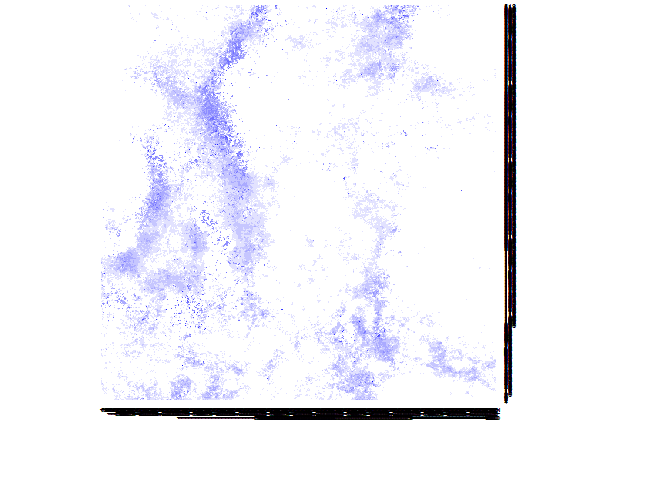

RCon3D: Analyzing 3D confocal images of microbial biofilms
----------------------------------------------------------

#### Functions

`loadIMG` Load .tif files and turn them into arrays, and save them as
RDS files ready for downstream analysis

`findIMG` Find already loaded images in a set directory

`quant` Quantifies the number of pixels in each image, for each channel
at each layer.

`layer_stand` Standardize layers based on fill. Relevant if the bottom
of the specimen is the layer with highest fill

`layer_split` Splits quantification in Top, Middle and Bottom based on
fill and/or a set number of layers

`occupancy` Estimates the proportion a (target) channel occupy around a
(focal) channel

`co_agg` Estimates the co-aggregation between two channels. An
undirected version of `occupancy`

`cross_ratio` Estimates the ratio between two channels (targets), at
some distance from a focal channel

`clumps` Find 3D clumps (aggregates) based on clumping together
neighbouring pixels.

`create_random` Create random images for testing

`create_nulls` Create image files for the empty spaces in an image, such
that this can be used in the analysis. For example, it can then be
calculated how much empty space there is a around a certain channel with
`occupancy`

`extract_layers` With the output from `layer_split` it makes a list of
what layers to analyze in `occupancy`, `clumps`, `co_agg` and
`cross_ratio`

#### Acknowledgment note:

An internal function, `tiff_to_array`, is partly borrowed from
<https://github.com/rmnppt/iMage>. Furthermore, some of the algorithmic
framework for the `co_agg`,`occupancy` and `cross_ratio` analysis is
also borrowed from this repository.

### Loading packages

First install the package

    library(devtools)
    install_github("Russel88/RCon3D")

Then lets load the package and some packages for plotting

    library(RCon3D)
    library(ggplot2)
    library(reshape2)
    library(scatterplot3d)

### Load the images

The example image has four channels (named "xan","pan","ste" and "mic").
It is available here (github/Russel88/RCon3D/ExampleData.zip)

The images have to be binary, and are assumed to have been thresholded
already

If the images have already been loaded we can use `findIMG` to load in
the images.

The path should lead to folder with a .tif for each image (with all
z-stacks in one), or a folder with subfolders in which the images is
split in z-stacks and channels.

    myimg <- loadIMG("/ExampleData",c("xan","pan","ste","mic"),split=TRUE)

    ## Loading image 1

    myimg <- findIMG("/ExampleData")

### Quantify pixels for each layer for each channel

First, lets quantify the pixels for each layer, channel and image

The naming argument is optional but can be used to look through the
names of the images and add corresponding variables Here it looks for
"24h" in the image name, and makes a variable called Time. This is of
course only useful when there are several images with different
metadata. (Eg. Time=c("12h","24h"))

    myq <- quant(myimg,channels=c("xan","pan","mic","ste"),naming=list(Time=c("24h")))
    head(myq)

    ##                          Img Channel Count Layer Time
    ## 1 FourSpecies24h_xan_Array.R     xan  1583     1  24h
    ## 2 FourSpecies24h_xan_Array.R     xan  1985     2  24h
    ## 3 FourSpecies24h_xan_Array.R     xan  2225     3  24h
    ## 4 FourSpecies24h_xan_Array.R     xan  2542     4  24h
    ## 5 FourSpecies24h_xan_Array.R     xan  3012     5  24h
    ## 6 FourSpecies24h_xan_Array.R     xan  3508     6  24h

Plot quantification

    p <- ggplot(data=myq,aes(x=Layer,y=Count,colour=Channel,group=Channel)) +
      theme_classic() +
      geom_freqpoly(stat="identity",position=position_dodge(width = 0),size=1) +
      coord_flip()
    p

As the bottom of the specimen is in the high numbers of the layers, lets
reverse layers and plot again.

Note that trim=TRUE. This is because we think the layer with most fill
is the actual bottom of the specimen, and we therefore trim away all
that is below that layer

    myq.std <- layer_stand(myq,layer.start = "Top",trim=TRUE)

    p <- ggplot(data=myq.std,aes(x=NewLayer,y=Count,colour=Channel,group=Channel)) +
      theme_classic() +
      geom_freqpoly(stat="identity",position=position_dodge(width = 0),size=1) +
      coord_flip()
    p

We can also split the image in top, middle and bottom based on various
criteria. Here we define the Top as all layers from the very top until
75 percent of the image is filled (pt=0.75). The bottom is the bottom 20
layers (add.b=20). The middle is the rest.

    myq.split <- layer_split(myq,layer.start = "Top",trim=TRUE,side=512,pt=0.75,add.b=20,add.t=0)

    p <- ggplot(data=myq.split,aes(x=Layer,y=Count,colour=Split,group=Split)) +
      theme_classic() +
      geom_freqpoly(stat="identity",position=position_dodge(width = 0),size=1) +
      coord_flip() +
      facet_grid(.~Channel)
    p

### 3D Co-aggregation (Cross-correlation)

Lets calculate 3D co-aggregation between channels "ste" and "xan".

This analysis is for determining how two channels are positioned
relative to each other

A co-aggregation of 1 equals random positioning at that specific
distance, &lt;1 means segregation and &gt;1 means aggregation.

It is similar to co-aggregation implemented in daime
(<http://dome.csb.univie.ac.at/daime>), although this function
calculates on randomly subsetted number of pixels which decreases
runtime.

First we find out how many microns we can scan. It has to be a multiple
of both zstep and pwidth

    pwidth <- 0.75
    zstep <- 0.25
    library(rootSolve)
    uniroot.all(function(x) x%%pwidth + x%%zstep,interval=c(0,30))

    ##  [1]  0.0  1.5  3.0  4.5  6.0  7.5  9.0 10.5 12.0 13.5 15.0 16.5 18.0 19.5
    ## [15] 21.0 22.5 24.0 25.5 27.0 28.5 30.0

Ok. lets try 21 microns then. As an example we pick 200 random pixels,
and we run the whole thing 5 times to see how picking random pixels
affect the variability of the result

    mycc <- co_agg(imgs=myimg,channels=c("xan","ste"),size=21,npixel=200,dstep=1,pwidth=0.75,zstep=0.25,R=5)

    ## 
      |                                                                       
      |                                                                 |   0%
      |                                                                       
      |=============                                                    |  20%
      |                                                                       
      |==========================                                       |  40%
      |                                                                       
      |=======================================                          |  60%
      |                                                                       
      |====================================================             |  80%
      |                                                                       
      |=================================================================| 100%

Plot the result

    p <- ggplot(mycc,aes(x=Distance,y=CA,group=R)) +
      theme_classic() +
      geom_hline(yintercept=1) +
      geom_line() 
    p

At small distances "xan" and "ste" appear to be intermixed more than
expected from random chance

### 3D Occupancy

We can also quantify how much space a channel (target) occupy at certain
distances from another channel (focal). This is similar to
co-aggregation, although this is directed.

Lets run it until 21 microns. As an example we pick 200 random pixels,
and we run the whole thing 5 times to see how picking random pixels
affect the variability of the result

    myocc <- occupancy(imgs=myimg,focal.channel="ste",target.channel="xan",size=21,npixel=200,dstep=1,pwidth=0.75,zstep=0.25,R=5)

    ## 
      |                                                                       
      |                                                                 |   0%
      |                                                                       
      |=============                                                    |  20%
      |                                                                       
      |==========================                                       |  40%
      |                                                                       
      |=======================================                          |  60%
      |                                                                       
      |====================================================             |  80%
      |                                                                       
      |=================================================================| 100%

Plot the result. The red line is the actual proportion occupied, the
black line is normalized such that random equals 1

    p <- ggplot(myocc,aes(x=Distance,y=Occupancy,group=R)) +
      theme_classic() +
      geom_hline(yintercept=1) +
      geom_line(colour="Red") +
      geom_line(data=myocc,aes(x=Distance,y=Occupancy.Normalized,group=R))
    p

### 3D aggregates

Lets find 3D aggregates of "mic"

kern.smooth=c(3,3,3) means that we median smooth the image with a 3x3x3
filter (x,y,z)

kern.neighbour=c(3,3,3) means that a 3x3x3 box is used to determine
whether pixels are in the same aggregate or not. c(3,3,3) is immediate
neighbours. c(5,5,5) would extend a pixel further in all directions.
c(3,3,1) would find aggregates for each x,y 2D plane

    my.agg <- clumps(myimg,"mic",kern.smooth=c(3,3,3),kern.neighbour=c(3,3,3),pwidth=0.75,zstep=0.25)

    ## Running replica 1

Lets plot the 3D image of aggregates larger than 20000 pixels

    # Find positions
    M <- melt(my.agg[[2]][[1]])

    # Remove NA's (former zeroes)
    M <- M[!is.na(M$value),]

    # Check out sizes and subset for the ones above 20000 pixels
    tabl <- as.data.frame(table(M$value))
    subtable <- tabl[tabl$Freq>20000,]
    M <- M[M$value %in% subtable$Var1,]

    # Plot it
    scatterplot3d(M$Var1,M$Var2,M$Var3,color=M$value)

### 3D Cross-ratio

It might be of interest to examine which of two channels is
closer/further from a focal channel.

For this we use a cross-ratio: At each distance from a focal channel,
what is the ratio between two target channels. Normalized to what is
expected given random chance. A cross-ratio above 1 at some distance
means that target channel 1 is more likely to be found than target
channel 2 at that distance.

    mycr <- cross_ratio(imgs=myimg,focal.channel="mic",target.channels=c("xan","pan"),size=21,npixel=200,dstep=1,pwidth=0.75,zstep=0.25,R=5)

    ## 
      |                                                                       
      |                                                                 |   0%
      |                                                                       
      |=============                                                    |  20%
      |                                                                       
      |==========================                                       |  40%
      |                                                                       
      |=======================================                          |  60%
      |                                                                       
      |====================================================             |  80%
      |                                                                       
      |=================================================================| 100%

Plot the result

    p <- ggplot(mycr,aes(x=Distance,y=CR,group=R)) +
      theme_classic() +
      geom_hline(yintercept=1) +
      geom_line() 
    p

